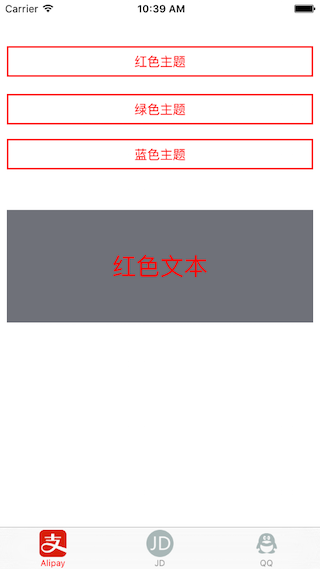
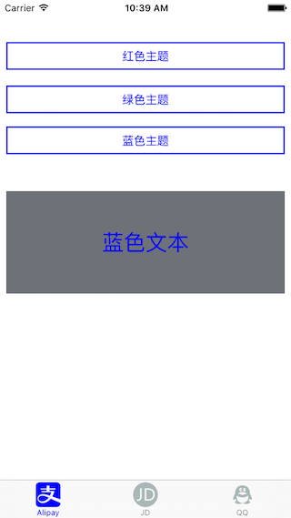

# ZZTheme
主题更换

####需求：####
项目中需要做到主题更换，比如黑夜/白天切换

####效果图：####


####思路：####
每一个要设置主题的对象动态关联两个主题(theme)对象，用这两个附带的对象记录下来配置信息，比如要设置主题的对象是：self.view, 之所以有两个配置对象，是为了可以使用Json和通过代码都可以达到配置效果，给self.view对象附带两个配置信息的对象： 

```
self.view.jsonTheme
self.view.codeTheme  
```

当通过这两个附加配置对象设置颜色等的时候，这两个附加配置对象记录下来配置信息，事先为self.view加了注册通知，当更换主题的时候，self.view就会接收到通知，由于self.view本身已经知道它要变成什么样(配置信息已记录下来，在jsonTheme|codeTheme)中，所以依次把配置信息给self.view赋上值即可。我使用了字典来保存这些配置信息：

```
/** 基本颜色 */
@property (nonatomic) NSMutableDictionary *info1;
/** 按钮标题色 */
@property (nonatomic) NSMutableDictionary *info2;
/** 按钮阴影色 */
@property (nonatomic) NSMutableDictionary *info3;
/** 按钮图片 */
@property (nonatomic) NSMutableDictionary *info4;
/** 按钮背景图片 */
@property (nonatomic) NSMutableDictionary *info5;
/** 图片 */
@property (nonatomic) NSMutableDictionary *info6;
...
```

####示例：####
通过代码设置背景色：

```
self.view.codeTheme.backgroundColor(RED, [UIColor redColor]).backgroundColor(GREEN, [UIColor greenColor]).backgroundColor(BLUE, [UIColor blueColor]);
```
上面代码的意思是：在主题RED下，self.view.backgroundColor是红色，在主题GREEN下, self.view.backgroundColor是绿色，在主题BLUE下，self.view.backgroundColor是蓝色  

再来看通过Json配置文件设置：

```
self.view.jsonTheme.backgroundColor(@"ident1");
```

通过这样设置，我们就可以达到和上面codeTheme设置的相同效果，但是我们必须有JSON文件(这个JSON文件可以从网络上下载的)，形如：

```
{
    "UIColor": {
        "ident1": "#FF0000",
        "ident2": "#FFFFCC"
    },
    "UIImage": {
        "ident1": "image_1.jpg",
        "ident2": "image_2.jpg",
        "ident3": "支付宝_red.png",
        "ident4": "京东_red.png",
        "ident5": "qq_red.png",
        "ident6": "支付宝_normal",
        "ident7": "京东_normal",
        "ident8": "qq_normal",
        "ident9": "image_2.jpg"
    },
    "NSString": {
        "ident1": "红色文本"
    }
}
```

注：由于基于这个思路，API比较多，笔者后来又根据一个比较简单的思路写了一个，可参见：[ZZSkin](https://github.com/ACommonChinese/ZZSkin)
